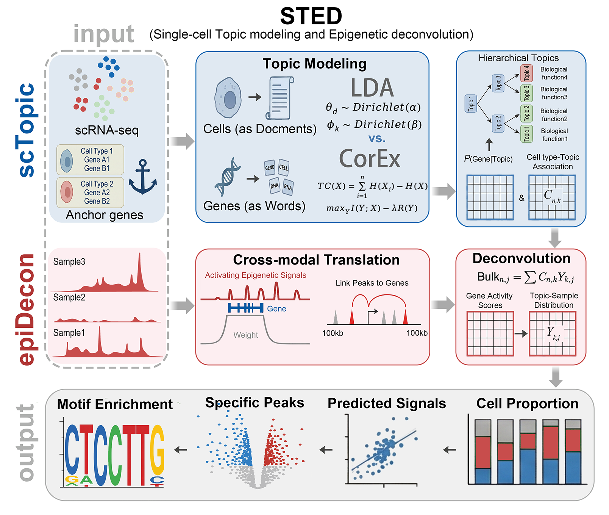

# STED: Single-cell Topic Modeling & Epigenetic Deconvolution

[](https://www.python.org/downloads/)
[](https://opensource.org/licenses/MIT)

**STED** is a Python package designed for the analysis of single-cell and bulk multi-omics data. It leverages topic modeling (Anchored CorEx/LDA/BERTopic) to identify cell-type-specific gene modules in single-cell data and uses these models to deconvolve bulk RNA-seq, ATAC-seq and ChIP-seq data, estimating cell type proportions and predicting cell-type-specific epigenetic signals.

<p align="center">
  
</p>

## 🌟 Features

* **Single-Cell Preprocessing**: Flexible filtering, normalization, and gene selection (HVG or Markers)
* **Guided Topic Modeling**: Support for **Anchored CorEx** and **LDA** to guide topic discovery using known marker genes
* **Hierarchical Visualization**: Visualize topic relationships using hierarchical clustering
* **Bulk Deconvolution**: Estimate cell type fractions in bulk RNA-seq or ATAC-seq (via Gene Activity Scores) using trained single-cell topic models
* **Signal Prediction**: Predict cell-type-specific peak accessibility (or gene expression) from bulk samples
* **Biological Annotation**: Integration with R-based tools for GO enrichment analysis of topics

## 📦 Modules Overview

### `scTopic`

Unsupervised discovery of transcriptional regulatory topics from scRNA-seq data using hierarchical topic modeling.

**Input**: Normalized single-cell gene expression matrix (cells × genes)

**Output**:
- Regulatory topics (gene sets with biological interpretation)
- Topic-cell assignments
- Hierarchical topic tree

### `epiDecon`

Deconvolve bulk epigenomic signals (e.g., ATAC-seq, ChIP-seq) using topic-derived signatures.

**Input**:
- Bulk epigenomic profile (genomic regions × signal)
- Topic-to-cell-type mapping from `scTopic`

**Output**:
- Estimated cell-type proportions
- Cell-type-specific epigenetic activity scores
- Enriched TF binding motifs per cell type

## 🧰 Installation

### Prerequisites

- Python 3.9+
- R (for GO enrichment analysis)

### Install from Source

```bash
# Clone the repository
git clone https://github.com/LiaoYunxi/STED.git
cd STED

# Install package
pip install .
```

### Dependencies

Core Python dependencies:
- `pandas`
- `numpy`
- `networkx`
- `anndata`
- `plotly` (for visualization)
- `scipy`
- `scikit-learn`
- `h5py`
- `matplotlib`

R dependencies (for TopicAnnotation):
- `clusterProfiler`
- `org.Hs.eg.db` (for human)
- `org.Mm.eg.db` (for mouse)
- Other Bioconductor packages

## 🚀 Quick Start

We provide a comprehensive tutorial in `tutorial.ipynb` to help you get started quickly.

### 1. Import Modules

```python
import os
import pandas as pd
from STED.Preprocessing import scPreProcessing, gsPreProcessing
from STED.scTopic import scTopic
from STED.epiDecon import epiDecon
```

### 2. Single-Cell Data Preparation

Initialize the preprocessing object with your single-cell RNA/Multiome count matrix (.h5ad) and cell type annotation (.txt).

```python
# Set paths
data_dir = './demo/PBMC'
out_dir = './demo/PBMC/test_CorEx'
sc_count_file = os.path.join(data_dir, "10k_PBMC_Multiome_RNA_count.h5ad")
sc_anno_file = os.path.join(data_dir, "MainCelltype.txt")

# Initialize and Load
scp = scPreProcessing()
scp.set_data(sc_count_file=sc_count_file, sc_anno_file=sc_anno_file)

# Filter Cells
scp.cell_selection()

# Select Genes (HVG, Marker, or Custom List)
# Example using a custom list of genes
gene_use = pd.read_csv(os.path.join(data_dir, "use_gene.csv"), index_col=0)['0'].to_list()
scp.geneWords(sc_anno_file, gene_use=gene_use)
```

### 3. Topic Modeling (Anchored CorEx)

STED supports semi-supervised learning. You can provide "Anchor Genes" to guide specific topics towards known biological functions or cell types.

```python
# 1. Preprocessing (linear2log=True recommended for CorEx)
scp.preprocessing(linear2log=True)

# 2. Define Anchor Genes (Nested list: one list per topic)
anchor_words = [
    ["CD79A", "MS4A1"],               # B cells
    ["GNLY", "NKG7"],                 # NK cells
    ["CCL5", "GZMK"],                 # T cells
    ["IL7R", "RORA","TCF7", "LEF1"],  # Naive/Memory T
    ["FCGR3A", "MS4A7", "LYZ", "CD14"], # Monocytes
    ["FCER1A", "CST3"]                # Dendritic cells
]

# 3. Apply Anchors
scp.preForGuide(anchored_genes=anchor_words)

# 4. Train the Model
sct = scTopic()
sct.setData(scp, out_dir)

# Train Anchored CorEx
# hierarchy_topic=[6,2] creates a hierarchy: 
# Layer 1: ntopics (e.g., 10 or 15) -> Layer 2: 6 topics -> Layer 3: 2 topics
# Note: For deconvolution tasks, a higher number of topics (e.g., 15) is often recommended.
sct.trainCorEx(
    seed=1,
    n_iter=200,
    ntopics=15,
    anchor_strength=2,
    hierarchy_topic=[6, 2],
    tc_plot=True  # Saves plots to out_dir/model/
)
```

Visualization: You can view the hierarchy of topics using Plotly:

```python
ht = sct.model.hierarchy(n_hidden_list=[6,2], max_edges=200, plot=True)
fig = sct.model.plot_hierarchy(ht)
fig.show()
```

### 4. Topic Annotation (GO Enrichment)

STED calls an external R script to annotate topics based on gene scores.

```bash
# Requires R and appropriate Bioconductor packages
Rscript ./R/TopicAnnotation.R -i "{out_dir}" -g human -s "1"
```

### 5. Bulk Data Preprocessing

Prepare bulk data for deconvolution. STED can handle bulk RNA-seq counts or ATAC-seq peaks (converting them to Gene Activity Scores).

```python
# Paths for bulk data
gs_count_file = os.path.join(data_dir, "peaks_GAS.txt")  # Gene Activity Scores
peak_count_file = os.path.join(data_dir, "peaks_counts.h5ad")  # Raw Peak Counts

epid = gsPreProcessing()

# Option A: Input calculated Gene Activity Scores (GAS) for Epigenetic data
epid.set_data(Epi=True, peak_file=peak_count_file, gs_count_file=gs_count_file)

# Option B: Input raw Peak file (STED will calculate GAS - requires gene_anno_file)
# epid.set_data(Epi=True, peak_file=peak_count_file, gene_anno_file="gene_anno.txt") 

# Option C: Input Bulk RNA-seq
# epid.set_data(Epi=False, gs_count_file="rna_counts.txt")

# Align bulk genes with single-cell topic genes
epid.gene_selection(scp.use_genes)
epid.preprocessing(linear2log=True)

# Ensure single-cell object only uses shared genes (Critical for Deconvolution)
scp.geneShared(epid.gs_genes)
```

> **Note**: If the gene set changes significantly after intersection (step `scp.geneShared`), you may need to re-initialize and retrain the `sct` model on this shared gene set to ensure optimal performance.

### 6. Deconvolution (Cell Type Fraction Estimation)

Use the trained single-cell topic model to deconvolve the bulk samples.

```python
epi = epiDecon()
epi.SetData(out_dir, scp, epid)

# Run Deconvolution
# model_selection options: "CorEx", "LDA", "ALDA"
# If model is None, it will try to load from out_dir
epi.Decon(
    ntopics_selection=15,
    seed_selection=1,
    model=sct,
    model_selection="CorEx",
    benchmark=False
)

# Apply Bayesian refinement
epi.Bayes()

# View Results
print(epi.celltype_frac_df)
```

### 7. Peak Signal Prediction

For epigenetic data, STED can predict the specific peak accessibility signals for each cell type within the bulk mixture.

```python
# Path to Gene-to-Peak projection matrix (calculated during GAS step)
GS_file = os.path.join(data_dir, "gene2peak_project_mat.h5ad")

# Predict Peak Signals
# If GS_file is None, it will be recalculated (requires gene_anno_file)
predicted_signals = epi.PeakPredict(
    sc_count_file,
    epid,
    GS_file=GS_file
)

# Returns a DataFrame where Index = Cell Type, Columns = Peaks
print(predicted_signals.head())
```

## 📚 Documentation

For detailed documentation, please refer to:
- [Tutorial Notebook](tutorial.ipynb)
- Individual module documentation in the code
- Example datasets in the Zendo, please refer to [STED:Supplement Information and Demo Data](https://doi.org/10.5281/zenodo.17931080)

## 📞 Contact

For questions or support, please contact:
- Liao Yunxi - 2211110091@pku.edu.cn

## 🙏 Acknowledgments

- Thanks to all contributors who have helped develop and improve STED
- This work was supported by the National Natural Science Foundation of China (NSFC, Grant No. 32270603) and the Beijing Natural Science Foundation (BJNSF, Grant No.5242010).